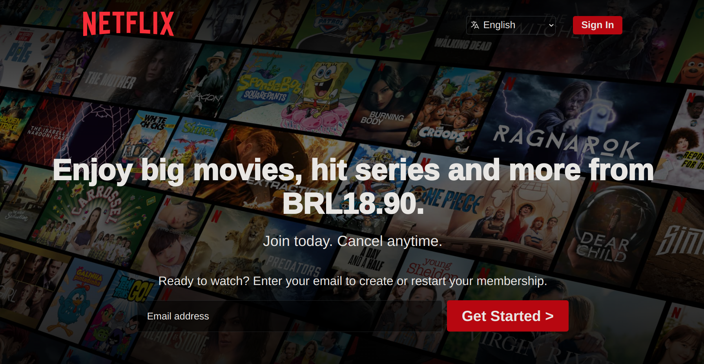

# Netflix Clone
A clone from Netflix home page.

## Technologies Used
- CSS
- HTML

## Features
- Splash section
- Main section with a grid
- Q&A section responding to clicks
- Ensuring responsiveness for different screen sizes

## Screenshots

  
  

## Acknowledgements
Special thanks to Dawid Paszko from the YouTube channel "Coding With Dawid" for providing a step-by-step guide on how to complete this project.